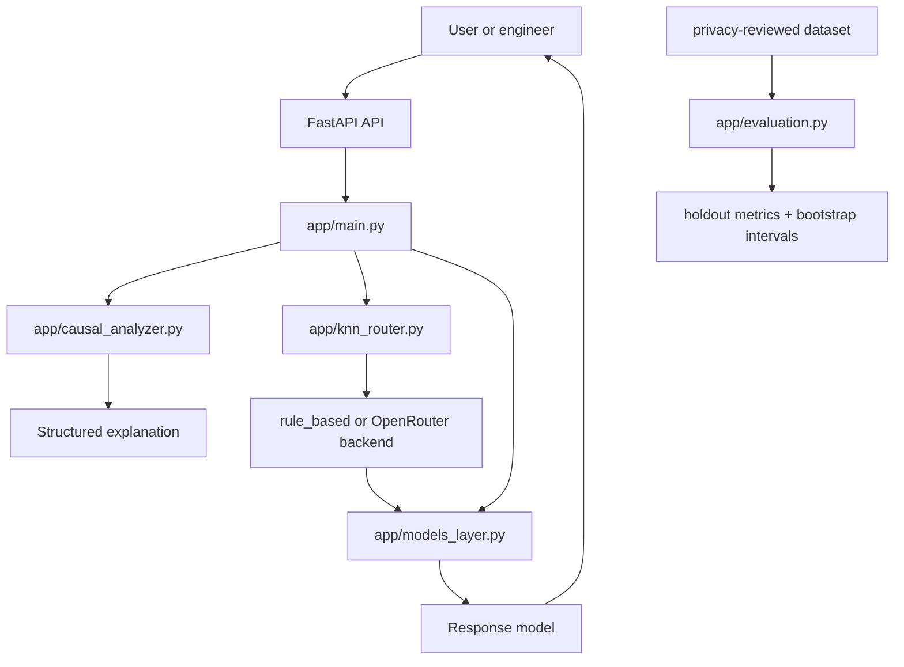

# Symptom-to-Root-Cause Incident Triage

A lightweight incident-triage prototype that turns operational symptoms into a ranked explanation of likely root causes, while keeping the reasoning inspectable.

This project is designed for a practical scenario: most production incidents are first observed as symptoms such as latency spikes, connection failures, or repeated errors. The system turns those symptoms into a structured causal hypothesis, chooses a backend for analysis, and optionally delegates to a model provider when configured.

## Latest updates

- The repository was reorganized into a cleaner package layout: `app/`, `tests/`, and `datasets/`
- The static metrics endpoint was replaced by a reproducible offline evaluation workflow
- Dataset validation now requires a privacy-review attestation and a reviewed manifest
- Evaluation runs by incident-level holdout, not log-level leakage
- Results include per-category metrics and bootstrap confidence intervals
- The KNN router now behaves as a measured backend selector, not as a direct causal-model oracle


## Project goal

The goal is not to claim perfect root-cause detection. The goal is to build a transparent, testable system that:

- extracts useful signal from symptom logs,
- produces a causal-style explanation,
- chooses a backend under cost-quality constraints,
- evaluates itself on a privacy-reviewed dataset with reproducible protocol,
- keeps human operators in the loop.

## Architecture



## Repository structure

```text
.
├── app/
│   ├── __init__.py
│   ├── main.py
│   ├── models.py
│   ├── causal_analyzer.py
│   ├── knn_router.py
│   ├── models_layer.py
│   ├── metrics.py
│   ├── evaluation.py
│   └── train_router.py
├── tests/
│   ├── test_api.py
│   ├── test_evaluation.py
│   └── test_router.py
├── datasets/
│   └── synthetic-smoke-v1.json
├── Dockerfile
├── requirements.txt
├── README.md
└── .env.example (if present in local setup)
```

## Core components

### app/main.py

FastAPI entrypoint and orchestration layer.

It exposes:
- `GET /` — browser demo
- `GET /health` — health check
- `GET /openrouter/models` — available free OpenRouter models
- `POST /analyze` — structured log analysis with backend routing
- `POST /infer-root-cause` — symptom-only category scoring
- `POST /metrics` — raw metric calculator for causal-chain comparisons

### app/causal_analyzer.py

Heuristic causal-chain generator.

Responsibilities:
- categorize log messages by pattern families such as database, network, memory, CPU, disk, and authentication
- build a simple causal chain from timestamped log events
- estimate a likely root cause and associated evidence
- return a debug-friendly explanation structure

Important caveat: this is still a rule-based heuristic, not a validated causal model.

### app/knn_router.py

Backend selection policy.

It extracts features from logs and context, learns from measured outcomes, and chooses the lowest-cost backend predicted to meet a minimum quality target. If the request falls outside the trained neighborhood, it falls back to the rule-based backend.

This router answers: “Which backend should I use for this incident?” It does not itself determine the causal root cause.

### app/models_layer.py

Provider abstraction layer.

Responsibilities:
- handle OpenRouter calls
- support deterministic local fallback logic
- wrap provider errors in a controlled way
- keep model usage isolated from the API layer

### app/metrics.py

Scoring utilities for evaluating causal-chain predictions.

Current metrics include:
- causal-chain recall
- ordered causal-chain recall via longest common subsequence
- root-cause accuracy helper

### app/evaluation.py

Offline evaluator and CLI.

This is the key improvement from the last update. It validates a privacy-reviewed dataset, performs an incident-level stratified holdout, computes per-category metrics, and reports 95% bootstrap intervals.

The evaluator enforces:
- schema version checks
- privacy-review approval status
- non-empty incident validation
- unique incident IDs
- non-empty timestamped logs
- a reproducible split by incident

## Evaluation workflow

Use an approved, privacy-reviewed dataset before making any claims about performance.

Example dataset structure:

```json
{
  "schema_version": 1,
  "dataset_id": "example-dataset",
  "dataset_version": "1.0.0",
  "privacy_review": {
    "status": "approved",
    "reviewed_on": "2026-10-01",
    "redaction_method": "Removed secrets, identifiers, and customer data before review."
  },
  "labeling_guidelines": "One root-cause category per incident.",
  "incidents": [
    {
      "id": "incident-001",
      "expected_category": "database",
      "logs": [
        {
          "timestamp": "2026-09-28T10:00:00Z",
          "source": "api",
          "level": "ERROR",
          "message": "Database connection pool exhausted"
        }
      ]
    }
  ]
}
```

Run the evaluator:

```bash
python3 -m app.evaluation datasets/synthetic-smoke-v1.json \
  --test-fraction 0.5 \
  --seed 42 \
  --bootstrap-samples 2000 \
  --out reports/evaluation.json
```

This produces:
- overall accuracy
- macro F1
- per-category precision/recall/F1
- 95% confidence intervals
- sample sizes and training/test split details

This is designed to produce evidence, not marketing numbers.

## Quickstart

### Install dependencies

```bash
python3 -m pip install -r requirements.txt
```

### Run the app

```bash
python3 -m app.main
```

Then open:
- http://localhost:8000/
- http://localhost:8000/docs

### Symptom-only inference

```bash
curl -sS http://localhost:8000/infer-root-cause \
  -H 'Content-Type: application/json' \
  -d '{"log_text":"Database connection timeout while querying users"}'
```

### Structured analysis

```bash
curl -sS http://localhost:8000/analyze \
  -H 'Content-Type: application/json' \
  -d '{"logs":[{"timestamp":"2026-09-28T10:00:00Z","source":"api","level":"ERROR","message":"Database query timeout"}],"context":"User requests failing"}'
```

## Environment variables

```dotenv
OPENROUTER_API_KEY=your-openrouter-key
OPENROUTER_MODEL=provider/model:free
ROUTER_CANDIDATE_MODELS=provider/model:free
ROUTER_MIN_QUALITY=0.8
ROUTER_MAX_COST_USD=0.01
```

## Testing

```bash
python3 -m pytest -q
```

## Design principles

- reasoning should be inspectable
- routing should be separated from diagnosis
- evaluation should be reproducible and privacy-aware
- uncertainty should be stated honestly
- the system should support human review, not replace it


## Recommended next steps

1. Replace synthetic or toy evaluation data with a reviewed incident corpus
2. Add a formal human-reviewed gold dataset and category taxonomy
3. Benchmark multiple backends on the same incident holdout
4. Add calibration and abstention behavior for low-confidence predictions
5. Measure operational outcomes such as MTTR reduction, analyst acceptance rate, and false escalation rate


1. **Establish a dataset and protocol.** Build a privacy-reviewed, labeled incident corpus with incident-level splits to prevent near-duplicate leakage. Record provenance, label confidence, and ambiguous cases.
2. **Create honest baselines.** Compare keyword rules with TF-IDF or embedding retrieval and a supervised classifier. Report macro-F1, per-category precision/recall, top-k accuracy, abstention quality, and confidence calibration.
3. **Strengthen the evidence model.** Preserve source spans and event identifiers, account for negation and temporal context, and separate direct observations from inferred relationships.
4. **Make the router earn its complexity.** Benchmark routing decisions against latency, cost, and diagnosis quality. Add a real model backend only where it improves the measured operating point.
5. **Add operational safeguards.** Bound request sizes, validate timestamps, redact sensitive data, structure logs, configure CORS deliberately, and use timeouts and graceful degradation for external dependencies.
6. **Test failure behavior.** Cover ambiguous and empty symptoms, overlapping categories, malformed records, timestamp edge cases, and unavailable model artifacts. Add deterministic evaluation tests separate from API smoke tests.
7. **Monitor after deployment.** Track category distribution, abstention rate, calibration, drift, latency, and operator feedback without retaining unnecessary sensitive log content.

## Portfolio Summary

This project demonstrates the end-to-end shape of an AI-assisted operations feature: typed API boundaries, modular inference components, transparent evidence, routing hooks, metric utilities, a browser demo, and a testable service. Its strongest claim today is architectural and implementation-oriented: it provides a concrete, explainable baseline for symptom-driven triage. Claims about accuracy, calibration, or production impact should wait until they are backed by a reproducible evaluation on representative incident data.